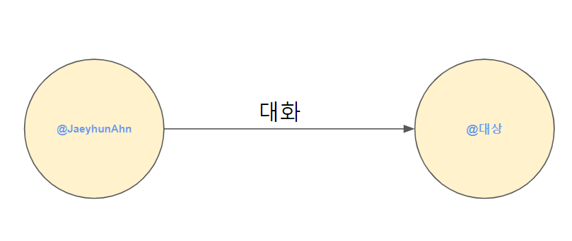
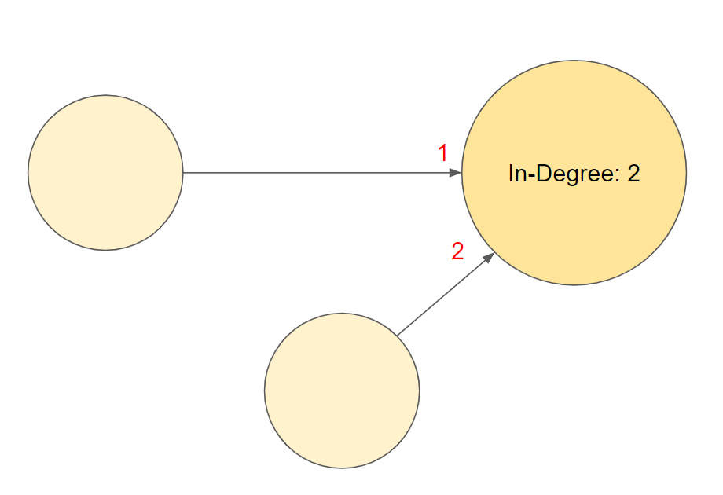
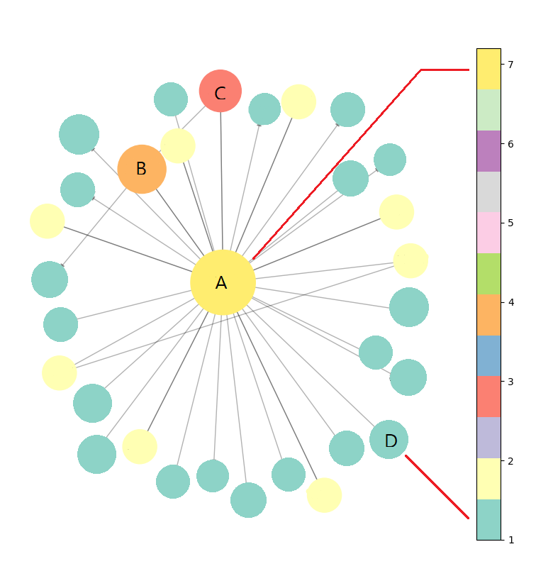
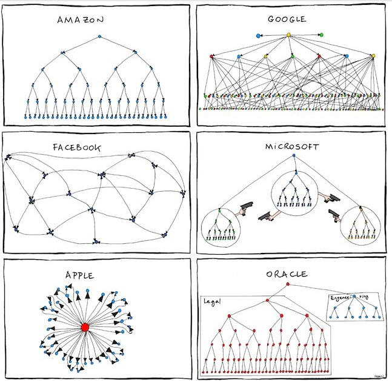
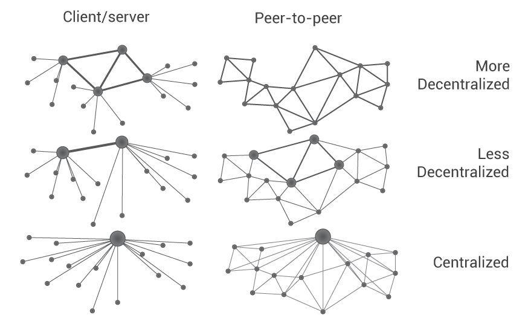
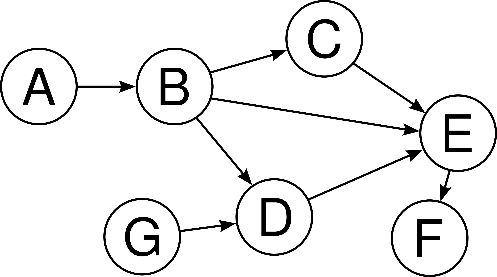

# 네트워크 리포트: 해설편
네트워크 위상학(Network Toplogy 또는 Graph Theory)은 망의 관계와 부하를 설명하기에 훌륭한 도구입니다. 위상학이라고 덥석 용어를 던지니 왠지모를 벽이 느껴지는 듯 합니다. 복잡해보이는 이 학문은 실은 간단한 문제에서 시작됐습니다.

     
[그림 1] 쾨니히스베르크의 다리건너기 문제
    

프로이센의 쾨니히스베르크(지금의 러시아 칼리닌그라드)에는 7개의 다리가 있었습니다. 마을 사람들은 각 동네에 있는 친구들을 효율적으로 만나고 싶어했고, 이 문제는 자연스럽게 다음과 같은 문제로 변형됐습니다.

> 어느 곳에서든 다리를 건너기 시작하여 모든 다리를 한 차례씩 모두 건널 수 있겠는가?

이 문제는 1735년에 레온하르트 오일러가 [어떤 증명](https://ko.wikipedia.org/wiki/%EC%BE%A8%EB%8B%88%ED%9E%88%EC%8A%A4%EB%B2%A0%EB%A5%B4%ED%81%AC%EC%9D%98_%EB%8B%A4%EB%A6%AC_%EB%AC%B8%EC%A0%9C)을 내어 놓음으로써 종결됩니다. 그리고 이를 시작으로 점과 선의 관계를 밝히는 네트워크 위상학이 발전합니다. 비약을 넣어 요약하자면 네트워크 위상학은 점과 선의 학문이라 할 수 있습니다.

**우리는 모두 지구상의 점**이라는 이야기를 들어보셨을지 모르겠습니다. 칼 세이건은 여기서 한 걸음 더 떨어져 **지구는 우주의 창백한 푸른 점**이라는 말도 했었지요. 관계는 점과 점을 잇습니다. 어떤 관계는 끊어지기도 합니다. 특정 시점에 이러한 상황을 그림으로 표현하면 점과 선으로 된 어떤 형태가 드러날 것입니다. 사람들은 이러한 도식을 *관계도*라 부릅니다.

 
[그림 2] 아내의 유혹 관계도

관계는 일방적일수도, 쌍방일 수도 있습니다. 또한 관계는 긍정적일 수도 있고, 부정적일 수도 있습니다. 컴퓨터는 관계가 긍정인지, 또는 부정인지 판단하기 어려워합니다. 컴퓨터는 그저 대화가 누구로부터 시작됐으며, 누구를 호출하고 있으며, 호출당한 상대는 어떤 말을 했는지 저장하고 있을 뿐 입니다.

상단에 있는 **아내의 유혹** 포스터는 네트워크 위상학 시각화를 훌륭하게 잘 해낸 예라 할 수 있습니다. 주인공인 구은재(민소희)는 대부분의 등장인물들로부터 관계를 요청 받고 있습니다. 들어오는 화살표가 많은 것이 그 증거입니다. 구은재의 영역은 받은 화살표에 비례하여 크기가 커집니다. 이를 통해 감상자는 **아내의 유혹**에서 구은재(민소희)가 많은 인물들과 관계하고 있다는 것을 직관적으로 이해할 수 있습니다. 반대로 관계하고 있는 원이 작은 것은 관계의 정도가 낮다는 것을 의미합니다. **아내의 유혹**이 전개되는데 꼭 필요하고, 때로는 이야기가 전개되는데 **중추인물**이 되기도 하지만, 빈도가 높지 않은 인물들이 이에 해당됩니다.

주의할것은 **원의 크기가 작다**고 하여 **중요하지 않은 인물이 아니라는 것**입니다. 앞서 설명했듯 주변 인물은 이야기를 매끄럽게 진행하게 하며 때로는 중추적 역할로 네트워크 관계를 원활히 동작하게 합니다. 이는 1973년에 Granovetter가 논문으로 [증명한 바](https://sociology.stanford.edu/sites/default/files/publications/the_strength_of_weak_ties_and_exch_w-gans.pdf) 있습니다. [1](#References)

중요한 것은 관계의 크기가 아니라 망(map)의 연결 관계입니다. 원의 크기는 관계의 끈끈함을 보장하지만 전체 구조의 견고성을 해치기도 합니다. 따라서 관계도의 안전한 해석을 위해서는 원의 비중 뿐만이 아니라 나와 관계하는 인물들간 다양성을 고민해야 합니다.

## 개요
시각화된 네트워크 그래프를 해석하려면 간단한 용어를 기억해야 합니다.

      
    [그림 3] 노드와 엣지를 설명하는 간단한 그래프

1. 노드(node 또는 vertex)

    노드는 재분배 지점 또는 종단점입니다. 이것은 사용자가 정의하는 무엇이든 될 수 있습니다. 노드는 국가가 될 수도 있고, 사람이 될 수 있으며, 분자가 될 수도, 원자, 전자가 될 수도 있습니다. 이것은 사용자가 관계로 정의할 수 있는 의미의 종단점입니다. 별자리를 이야기한다고 했을 때, 노드는 별을 의미합니다.
    
2. 엣지(edge 또는 간선, 변)

    엣지는 두 개의 노드를 잇는 선입니다. 이 선은 연결된 두 노드가 어떻게든 관계를 맺고 있음을 시각적으로 표현하기 위한 것입니다. 관계가 일방적이면 단방향(directed), 쌍방의 관계를 맺는 경우엔 양방향(undirected 또는 bidirected)의 선분으로 표현됩니다. 노드의 정의가 자유롭듯, 엣지의 정의 또한 자유롭습니다. 사람간 노드에서 엣지는 커뮤니케이션이 될 수도, 금액이 될 수도, 호감도가 될 수도 있습니다. 별자리에서 엣지는 별간에 그을 수 있는 선을 의미합니다.

3. 그래프(graph)

    노드와 엣지가 만나 쌍을 이루는 모양을 그래프라고 합니다. 관계에 의미를 갖는 최소 단위인 두 개의 노드와 한 개의 엣지부터 그래프라고 합니다. 그래프는 유한한 것을 표현하기 위한 수단이기 때문에 셈이 가능한 계(system)에서 사용할 수 있습니다. 별자리에서 그래프는 별자리가 완성되어 나타나는 표현 형태입니다.
    
## 대화분석
대화는 빠르게 흘러갑니다. 대화를 놓치지 않기 위해서 우리는 @ 라는 태그를 달아 상대방에게 알림을 보내기도 합니다.

 
    [그림 4] 태그를 달아 대화를 전달합니다

이렇게 놓치지 않는 대화가 생깁니다. 이때 대화는 @JaehyunAhn으로 부터 시작되어 @대상에게 전해집니다. 이 대화를 그래프의 관점에서 해석한다면 노드는 @JaehyunAhn과 @대상이고, 엣지는 @JaehyunAhn으로 부터 @대상에게 뻗는 방향이 있는 선이 될 것입니다.

     
    [그림 5] @JaehyunAhn 이 @대상을 태그하여 대화한 관계를 그래프로 표현

이제 @대상이 @JaehyunAhn 뿐만 아니라 여러 사람으로부터 호출을 받았다고 가정해봅시다. 노드 입장에서 호출을 받은 횟수를 그래프 이론 용어로 인-디그리(in-degree)라고 하며, 호출을 한 횟수를 아웃-디그리(out-degree)라고 합니다. [그림 6]

 
    [그림 6] In-degree가 2인 노드를 시각화한 그래프

만약 그래프의 노드가 기하급수적으로 증가하게 되면 어떤 노드가 디그리가 높은지 직관적으로 판단할 수 없게 됩니다. 때문에 노드의 크기는 인-디그리의 횟수에 비례하여 키우는 방식을 사용하여, 그래프가 완성됐을 때 호출 빈도가 많은 사람들을 직관적으로 파악할 수 있도록 했습니다.

## 개인분석
다음은 개인 대화 분석 그래프 명령 실행 결과입니다.

 
    [그림 7] 개인분석 결과 그래프

A 노드에 일반적으로 명령 실행자의 이름이 들어가 있습니다. 이 그래프는 명령 실행자가 **호출된** 행위와 명령 실행자가 타인을 **호출한** 행위를 누적하여 그려집니다. 때문에 일반적으로 명령 실행자는 A 노드에 위치하게 되며, A 노드를 중심으로하는 관계 그래프가 형성됩니다. 

노드 A뿐 아니라 B와 C, D 등 노드의 색은 각기 다릅니다. 이것은 인-디그리의 횟수에 따라 호출받은 횟수를 시각화 하기 위한 것으로, 그 범례는 [그림 7] 오른쪽에 테이프 형태로 컬러바를 표현하여 나타냈습니다. 컬러바 외에 표시한 숫자는 인-디그리의 상대적 차이를 나타내는 것으로, B 노드는 D 노드에 비해 약 4배 정도 호출 빈도가 잦다고 해석할 수 있습니다.

## 전체분석

개인 결과 그래프를 가지고 다른 분들과의 그래프를 비교하다 보면, 두 명의 개인 그래프를 모아 더 큰 그래프를 만들면 어떨까? 하는 질문에 이를 수 있습니다. 네트워크 위상학은 20세기 후반 인터넷이 보급되면서 망 분리 또는 기지국의 적절한 위치 선정에 크게 기여한 바 있으며, 21세기에는 물류, 조직 그리고 커뮤니케이션 문화가 대두되면서 다시 한 번 효과적으로 사용된 바 있습니다.

      
    [그림 8] 글로벌 IT 회사의 커뮤니케이션과 업무 구조를 간단하게 도식화 한 그림

IT 기술은 인류의 커뮤니케이션 범위를 물리적 공간에서 망(net) 공간으로 확장시켰습니다. 이것은 휘발되지 않고, 언제든 열람이 가능하며, **권한이 있는 누구든** 지난 대화를 복기할 수 있게 합니다. 그렇지만 접속과 커뮤니케이션의 자유가 있다 하여도 업무 계층이 발생하는 것을 쉬이 극복할 수 있는 것은 아닙니다. 당연한 이야기지만 **둘은 다른 이야기이기 때문**입니다.

    
      
    [그림 9] 그래프 모양에 따른 유형 구분, 1964, Paul Baran

1. 중앙집권적 그래프(Centralized Graph)

    그래프 분석은 망(net) 또는 계(system)의 커뮤니케이션 구조를 한 눈에 파악할 수 있게 합니다. 중심 노드(in-degree)가 되는 것은 좋은 경험일 수도 있습니다. 그렇지만 중심 노드가 많은 그래프(A)는 처리해야 할 데이터가 많습니다. 또한 중심 노드는 다른 노드에 큰 영향을 주기 때문에 유휴(idle) 상태를 불허합니다. 망 관점에서 보면 종단 노드까지 단 1회에 정보가 전파되기 때문에 효율적이어 보일 수 있으나 손실과 공격에 취약하다는 약점 또한 가지고 있습니다.
        
2. 탈중앙 그래프(Decentralized Graph)

    중앙 집권적 그래프가 중앙 노드가 1개라면, 탈중앙 그래프에서는 중추 역할을 하는 노드가 2개 이상입니다. 탈중앙 그래프의 경우 강도에 따라 강한 탈중앙(More Decentralized), 약한 탈중앙(Less Decentralized)된 형상을 보입니다. **더와 덜**의 기준은 상대적인 것이나, 일반적으로 중추 역할을 하는 그래프의 이웃이 많으면 많을수록 강하게 탈 중앙화 된 그래프라 할 수 있습니다. [그림 10] 참조.
    
    

        
         
        [그림 10] 그래프 모양에 따른 탈중앙화 유형 구분
    

3. 분산 그래프(Distributed Graph)

    모든 노드가 비슷한 수준의 인-디그리(in-degree)를 가질때 (C)와 같은 그래프가 나옵니다. 이 그래프는 부하가 잘 분산되어 있기 때문에 장애나 과부하, 오염에 강하다고 할 수 있으나 노드간 평균 전달거리가 긴 현상을 보입니다.

    
     
    [그림 11] 각 과업을 효율적으로 수행할 수 있는 그래프 형태

각 네트워크 유형들은 어떤 것이 최상이다, 이상적이라고 할 것이 없습니다. 그래프의 형태마다 쓰임새가 다르고, 장점/단점이 다르기 때문입니다. 따라서 시스템을 구성하기 앞서 과업의 특성을 파악하고 해당 과업을 효율적으로 수행할 수 있는 형태로 그래프를 구성해야 할 것입니다. 

따라서 그래프 분석은 **특정 그래프의 맹목적인 추구**가 아니라, 1) 현재 데이터 플로우 그래프가 어떤 형태를 취하고 있는가와 2) 시간이 흐름에 따라 어떤 형태로 변하고 있는가 하는 현상을 파악하고, 3) 그래프가 해당 시스템이 마주한 미션을 해결하는데 적합한 방식으로 움직이고 있는지 마지막으로 3) 다른 그래프의 장점/단점이 현재 겪고 있는 문제보다 **덜 고통스러운가**를 천천히 비교하며 접근해야 할 것입니다. 현재 시스템이 형성된 형상은 외부 자극이 없다는 전제 아래 **자연스러운 것**이기 때문에, 외부 자극이 주어졌을 때 영향을 미칠 수 있는 사이드 이펙트 버퍼까지 계산을 두고 변화를 고려해야 합니다.

## 거리분석

거리 분석은 [여섯 단계 분리 이론](http://socialcomputing.tistory.com/entry/6%EB%8B%A8%EA%B3%84-%EB%B6%84%EB%A6%AC-%EC%9D%B4%EB%A1%A0%EA%B3%BC-%EC%86%8C%EC%85%9C%EB%84%A4%ED%8A%B8%EC%9B%8C%ED%81%AC)에서 출발합니다. <여섯 단계 분리 이론> 이론은 하버드대 심리학 교수인 스탠리 밀그램이 발표한 논문[2](#References)을 통해 일반인들에게 알려지기 시작합니다. 그 이론이란,

> 전 세계 사람 중 임의의 사람을 선택해서, 여섯 단계만 거치면 전 세계의 모든 사람들을 아는 것이 가능하다.

는 것입니다.

한 회사 내에서 다른 한 사람과 대화의 물고를 터는 것은 어렵지 않을 것 입니다. 그 사람을 알 것 같은 부서의 사람과 대화를 나누면 그만이지요. 그렇지만,

> 대화를 할 마땅한 계기(업무, 모임)가 있지 않은 상태에서 목표만 주어졌을 때 몇 단계의 사람을 거쳐야 하는가?

하는 문제는 <6단계의 분리> 문제와는 다른 형태를 보입니다. 전자의 그것은 '안다'라는 느슨한 기준을 가지고 무작위 + 기하급수적으로 엣지가 연결되는 형태라면, 후자는 시작점과 종단점이 명확히 정해진 여정이라는 것 입니다. 따라서 거리분석 여정은 시작과 동시에 끝이 날 수도, 특별한 계기가 없이는 대화가 성사되지 않을 것이라는 것을 내어 보일 수도, 어쩌면 관계가 이어지지 않은 그룹간 목표설정으로 대화 기회가 영영 없을지도 모릅니다.

    
     
    [그림 12] 그래프, 거리분석에서 A와 E를 잇는 가장 짧은 길은 A->B->E 이다. 그렇지만 E에서 A로 가는 길은 존재하지 않음.

거리분석은 맴버 전체의 그래프를 사용하여 시작노드(자신)와 종단노드(대상)간의 관계를 밝힙니다. 그래프 이론에서는 이러한 여정을 길(path)이라고 부릅니다. 우리는 여정을 통해 대상 노드까지 가는 길을 알 수 있고, 자주 이름이 나오는 노드의 존재를 확인하면서 그 인물이 그래프의 허브(hub)임을 간접적으로 알 수 있습니다. 만약 자신이 허브라면 임의의 맴버들을 향한 여정이 짧은 경향을 보일 것입니다.

## 그래프 이론
아래서부터는 결과 분석에 초점보다는 일반적인 그래프 해석에 대한 기본 이론을 다룹니다. 그래프 이론에 대한 지식 습득에 의욕이 없으신분들은 흥미가 급격하게 떨어질 수 있습니다.
### 클러스터
### 허브(centrality)
### 중심 노드(Centrality Node)를 바라보는 다양한 관점
[3](#References)
### 흔한 네트워크 토폴로지(Common Network Topologies)

[4](#References)

## 알고리즘
### 시각화 방식
#### 배치
https://en.wikipedia.org/wiki/Force-directed_graph_drawing
#### 색
https://matplotlib.org/examples/color/colormaps_reference.html
# References
1. Granovetter의 해당 논문은 약 5만 회가 넘게 인용이 된 고전 중의 고전입니다.
2. The small world problem, http://snap.stanford.edu/class/cs224w-readings/milgram67smallworld.pdf
3. 중심 노드를 바라보는 다양한 관점, http://www.kwangsiklee.com/2017/11/%EA%B7%B8%EB%9E%98%ED%94%84-%EC%9D%B4%EB%A1%A0-%EA%B8%B0%EC%B4%88-%EC%A0%95%EB%A6%AC/
4. Common Network Topologies, https://en.wikibooks.org/wiki/Communication_Networks/Network_Topologies
5. 네트워크 그래프 라이브러리. https://networkx.github.io/
6. 슬랙 API, https://api.slack.com/
7. gevent 비동기 라이브러리, https://pypi.org/project/gevent/
8. 컬러맵 시각화, https://matplotlib.org/examples/color/colormaps_reference.html
9. <링크>, A.L. 바라바시